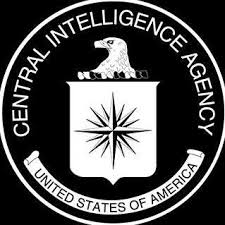
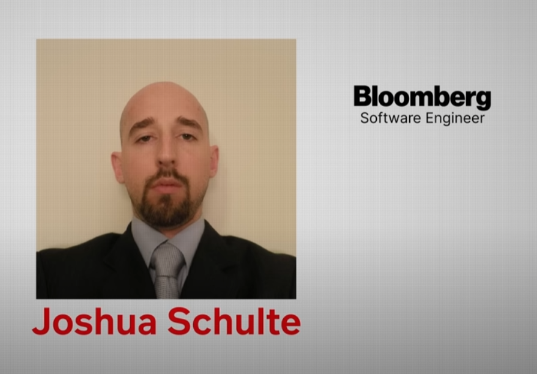

	Leave at 702
# CIA WikiLeaks

# Main note

**Date**: 2024-08-02

## Index

- [Introduction](#introduction)
- [Key Concepts](#key-concepts)
  - [Vault 7](#vault-7)
  - [CIA Hacking Tools](#cia-hacking-tools)
  - [The Leak and its Implications](#the-leak-and-its-implications)
  - [Joshua Schulte](#joshua-schulte)
- [Examples](#examples)
- [Applications](#applications)
- [Summary](#summary)
- [References](#references)

---

## Introduction

### Overview
The video explores the story behind the Vault 7 leaks by WikiLeaks, which exposed the CIA's hacking and surveillance tools. It delves into the implications of these leaks and the role of Joshua Schulte, the alleged leaker.

### Learning Outcomes
- Understand the significance of the Vault 7 leaks.
- Learn about the specific hacking tools developed by the CIA.
- Comprehend the impact of these leaks on national security.
- Gain insight into the motivations and actions of Joshua Schulte.

---

## Content

### Key Concepts

#### Vault 7
[Vault 7](https://en.wikipedia.org/wiki/Vault_7) refers to the leaks that has been made by WikiLeaks in 2017. This leak mainly revealed the [CIA](https://www.cia.gov/)'s Extensive set of hacking tools and Surveillance capabilities. This leak was one of the largest leaks of classified intelligence Documents in history. This was a devastating Blow to the US Government.

#### CIA Hacking Tools
The leaked documents detailed various tools developed by the CIA, including:
- **[Hive](#https://en.wikipedia.org/wiki/Hive_(ransomware)**: A command and control framework for managing malware implants.
- **[Scribbles](https://securityaffairs.com/58518/hacking/wikileaks-cia-scribbles.html)**: A tool for tracking access to confidential documents.
- **[Fine Dining](https://wikileaks.org/ciav7p1/cms/page_20251099.html)**: Malware disguised as legitimate software.
- **[Sonic Screwdriver](https://wikileaks.org/ciav7p1/cms/page_20251099.html)**: A tool that targets Apple devices at the firmware level.
- **[Weeping Angel](https://wikileaks.org/ciav7p1/cms/page_12353643.html)**: Software that turns Samsung TVs into listening devices.

#### The Leak and its Implications
The leaks exposed the vulnerabilities in devices and the methods used by the CIA for surveillance, sparking debates about privacy, security, and the ethical implications of such operations. The leaks also highlighted the potential risks of stockpiling zero-day vulnerabilities.

The leaks opened the box of vulnerabilities in devices and the methods used by the CIA for surveilance

#### Joshua Schulte
Joshua Schulte, a former CIA software engineer, was identified as the primary suspect behind the Vault 7 leaks. His motivations were allegedly tied to workplace conflicts and his dissatisfaction with the agency's handling of his complaints.

### Examples
- Hive allowed the CIA to control compromised systems through seemingly ordinary websites.
- Scribbles embedded unique watermarks in documents to track whistleblowers and spies.
- Fine Dining used decoy applications to deliver malware to target systems.
- Sonic Screwdriver compromised Apple's Thunderbolt adapters to execute malicious code.
- Weeping Angel enabled Samsung TVs to record conversations even when turned off.

### Applications
The tools described in the leaks had various applications, primarily in intelligence and surveillance operations. They allowed the CIA to gather information, track targets, and conduct covert operations without detection.

### Summary
The Vault 7 leaks exposed the CIA's advanced hacking capabilities and raised significant concerns about privacy, security, and the ethical use of surveillance tools. Joshua Schulte's role in the leaks underscores the potential consequences of internal conflicts and the handling of sensitive information within intelligence agencies.

### References
- WikiLeaks Vault 7 documentation
- News reports from The Guardian, Wired, and The New York Times
- CIA statements and responses to the leaks

---
information
- date: 2024.08.02
- time: 20:57

