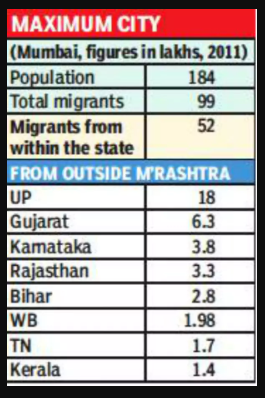
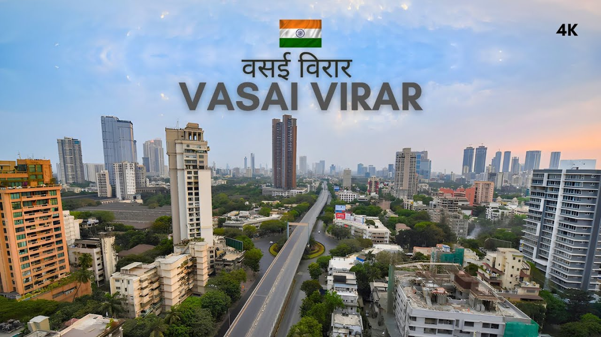

# Index
Author : Sumit Pandey
Roll No : K044

# Content

## Why
First we will look onto why people from sub economic states travel to financial capitals like Mumbai and Delhi

1. **Economic Opportunities**: Mumbai has been titled the financial capital of India. With that title comes the wide range opportunities of employment. Due to this people from other states come flocking by.

2. **Industrialization**: The city's industrial growth provides jobs in factories, construction, and other manual labor sectors, which often draw workers from rural areas of UP and Bihar and other states.

3. **Better Living Standards**: Many people migrate in search of better living standards, education, and healthcare facilities available in metropolitan cities like Mumbai.

4. **Agricultural Challenges**: Frequent agricultural challenges like floods, droughts, and low productivity in states like UP and Bihar push people to seek alternative livelihoods in urban areas.

5. **Family and Social Networks**: Established networks of friends and family members already living in Mumbai can provide support and help new migrants find accommodation and jobs.

6. **Transportation**: Improved connectivity through railways and highways makes it easier for people to travel to Mumbai.

7. **Education and Skills Development**: Many people move to Mumbai to pursue higher education and vocational training, leading to better job prospects.

## What are the consequences
People easily Migrate but then to pay for affordable housing they struggle to maintain an economy with such expensive housing rates in Mumbai. For example a person who would for beginners try to stay at [Mulund](https://en.wikipedia.org/wiki/Mulund) which is reasonably cheaper will then try to switch to a place like [Virar](https://en.wikipedia.org/wiki/Virar) because of the high rent rates. 
Some of the reasonable factors are:

1. **High Cost of Living**: The cost of living in central Mumbai is very high, making it difficult for migrants with low-income jobs to afford rent and other living expenses.

2. **Lack of Affordable Housing**: The shortage of affordable housing options in Mumbai forces many migrants to look for accommodation in distant suburbs or informal settlements.

3. **Urban Overcrowding**: Central Mumbai and its prime locations are heavily crowded, with limited space for new housing developments, pushing migrants to peripheral areas.

4. **Proximity to Employment Hubs**: Despite being distant, areas like Virar and Nala Sopara are well-connected by suburban trains to employment hubs, making them viable options for migrants.

5. **Informal Settlements**: Areas like Dharavi, one of Asia's largest slums, offer affordable housing options through informal settlements where rents are relatively low compared to other parts of Mumbai.

6. **Community Networks**: Migrants often move to areas where they have community connections or where other people from their home states have settled, providing a support network.

7. **Development in Suburbs**: Suburban areas like Virar and Nala Sopara have seen development in terms of housing projects, albeit at lower costs, attracting migrants who seek better living conditions within their financial means.

8. **Transport Connectivity**: Efficient local train services and bus networks enable migrants to live in distant suburbs and commute to their workplaces in the city.

These factors collectively result in the displacement of migrants to more affordable and accessible areas on the outskirts of Mumbai, such as Virar, Dharavi, and Nala Sopara.](<# Index
Author: Sumit Pandey  
Roll No: K044  

1. [Why People Migrate to Financial Capitals](#why-people-migrate-to-financial-capitals)
   - [Economic Opportunities](#economic-opportunities)
   - [Industrialization](#industrialization)
   - [Better Living Standards](#better-living-standards)
   - [Agricultural Challenges](#agricultural-challenges)
   - [Family and Social Networks](#family-and-social-networks)
   - [Transportation](#transportation)
   - [Education and Skills Development](#education-and-skills-development)
   
2. [Consequences of Migration](#consequences-of-migration)
   - [High Cost of Living](#high-cost-of-living)
   - [Lack of Affordable Housing](#lack-of-affordable-housing)
   - [Urban Overcrowding](#urban-overcrowding)
   - [Proximity to Employment Hubs](#proximity-to-employment-hubs)
   - [Informal Settlements](#informal-settlements)
   - [Community Networks](#community-networks)
   - [Development in Suburbs](#development-in-suburbs)
   - [Transport Connectivity](#transport-connectivity)

# Content

## Why People Migrate to Financial Capitals

First, we will look into why people from sub-economic states travel to financial capitals like Mumbai and Delhi.

1. **Economic Opportunities**: Mumbai has been titled the financial capital of India. With that title comes a wide range of employment opportunities. Due to this, people from other states flock here.

2. **Industrialization**: The city's industrial growth provides jobs in factories, construction, and other manual labor sectors, which often draw workers from rural areas of UP and Bihar and other states.

3. **Better Living Standards**: Many people migrate in search of better living standards, education, and healthcare facilities available in metropolitan cities like Mumbai.

4. **Agricultural Challenges**: Frequent agricultural challenges like floods, droughts, and low productivity in states like UP and Bihar push people to seek alternative livelihoods in urban areas.

5. **Family and Social Networks**: Established networks of friends and family members already living in Mumbai can provide support and help new migrants find accommodation and jobs.

6. **Transportation**: Improved connectivity through railways and highways makes it easier for people to travel to Mumbai.

7. **Education and Skills Development**: Many people move to Mumbai to pursue higher education and vocational training, leading to better job prospects.

## Consequences of Migration

People easily migrate, but then to pay for affordable housing, they struggle to maintain an economy with such expensive housing rates in Mumbai. For example, a person who would initially try to stay at [Mulund](https://en.wikipedia.org/wiki/Mulund), which is reasonably cheaper, will then try to switch to a place like [Virar](https://en.wikipedia.org/wiki/Virar) because of the high rent rates. Some of the reasonable factors are:

1. **High Cost of Living**: The cost of living in central Mumbai is very high, making it difficult for migrants with low-income jobs to afford rent and other living expenses.

2. **Lack of Affordable Housing**: The shortage of affordable housing options in Mumbai forces many migrants to look for accommodation in distant suburbs or informal settlements.

3. **Urban Overcrowding**: Central Mumbai and its prime locations are heavily crowded, with limited space for new housing developments, pushing migrants to peripheral areas.

4. **Proximity to Employment Hubs**: Despite being distant, areas like Virar and Nala Sopara are well-connected by suburban trains to employment hubs, making them viable options for migrants.

5. **Informal Settlements**: Areas like Dharavi, one of Asia's largest slums, offer affordable housing options through informal settlements where rents are relatively low compared to other parts of Mumbai.

6. **Community Networks**: Migrants often move to areas where they have community connections or where other people from their home states have settled, providing a support network.

7. **Development in Suburbs**: Suburban areas like Virar and Nala Sopara have seen development in terms of housing projects, albeit at lower costs, attracting migrants who seek better living conditions within their financial means.

8. **Transport Connectivity**: Efficient local train services and bus networks enable migrants to live in distant suburbs and commute to their workplaces in the city.

These factors collectively result in the displacement of migrants to more affordable and accessible areas on the outskirts of Mumbai, such as Virar, Dharavi, and Nala Sopara.>)